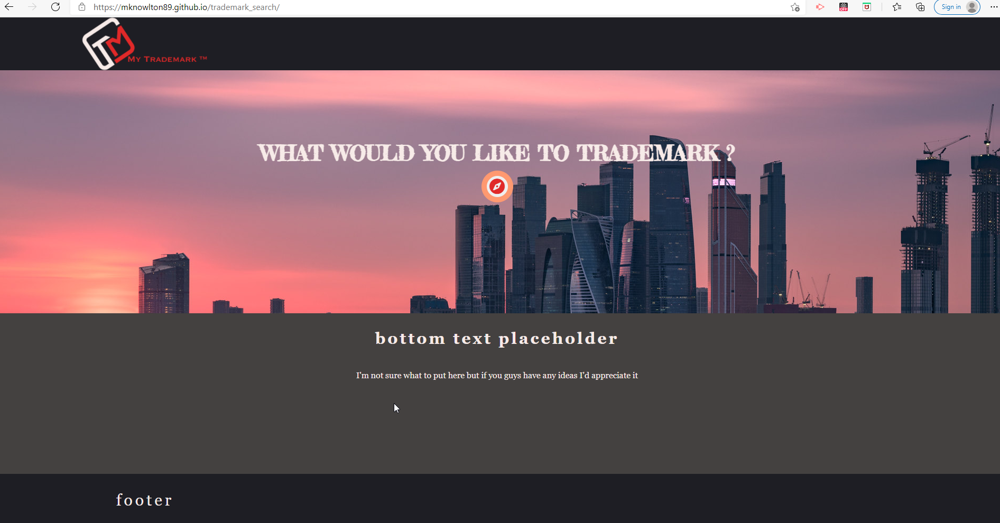

# Project-1
This is the first project(Trademark Search) for Georgia Tech's Fullstack Bootcamp. 

## Description
This is a website companies and entrepreneurs can visit to easily check if a slogan/mark is already trademarked or not.

If the trademark is available, we’ll query a domain API to check if the domain for the slogan/mark is available.

Additionally, if the trademark is available, we’ll display a link to the US Trademark Office to enable the visitor to start their application to obtain the trademark.

## Deployed Site
deployed site below:

[Deployed Site](https://mknowlton89.github.io/trademark_search/)
